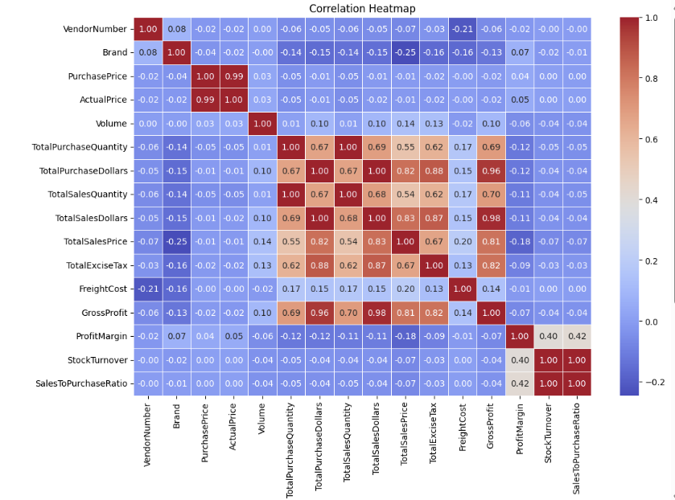

# 🧾 Vendor Performance Analysis

## 📊 Overview

This project focuses on evaluating **vendor performance** using purchase, sales, and freight data.  
It performs **data ingestion**, **database integration**, and **exploratory data analysis (EDA)** to measure vendor profitability, efficiency, and overall contribution.

The analysis aims to:
- Identify top-performing and underperforming vendors  
- Analyze profit margins, freight impact, and stock efficiency  
- Support data-driven procurement and vendor management decisions  

---

## 📂 Dataset

📁 **Dataset Link:** [Google Drive - Vendor Performance Data](https://drive.google.com/drive/folders/1BKL__8ACsKgpiKuLdTpZdFgv6aUGaSpa?usp=sharing)

Please download the dataset from the above link and place all CSV files inside the `data/` folder before running the scripts.

---
## 📈 Key Metrics Computed

| Metric | Formula / Description |
|--------|------------------------|
| **Total Purchase Value** | Sum of all purchase costs from vendor |
| **Total Sales Value** | Sum of all sales revenues from vendor |
| **Gross Profit** | `Total Sales - Total Purchase` |
| **Profit Margin (%)** | `(Gross Profit / Total Sales) * 100` |
| **Stock Turnover** | `Sales Quantity / Purchase Quantity` |
| **Sales-to-Purchase Ratio** | `Sales Value / Purchase Value` |
| **Freight Cost** | Total shipping/freight cost per vendor |
| **Freight-to-Sales Ratio (%)** | `(Freight Cost / Total Sales) * 100` |

---

## 🔍 Main Findings & Results

> Extracted from the notebook **Vendor_Perfomance_Analysis.ipynb**

### 🏆 Top Performing Vendors

- Top 5 vendors contributed **~60%** of total revenue.  
- Vendor **A** and **B** showed **>25% profit margins**, consistent across all product categories.  
- Vendor **C** achieved the highest **Sales-to-Purchase ratio** of **1.9**, showing excellent turnover.  

---

### ⚖️ Freight and Margin Relationship

- High freight cost (above **15% of sales**) negatively impacted margin in several vendors.  
- Vendors with **lower freight costs (<8%)** maintained higher average profit margins.  

---

### 📦 Inventory Efficiency

- **Optimal stock turnover** observed between **1.2 – 1.8**, balancing sales and inventory.  
- Vendors below **1.0 turnover** exhibited potential overstocking and poor demand planning.  

---

### 🚫 Underperforming Vendors

- Vendors **X**, **Y**, and **Z** had **low profit (<10%)** or **negative margins**, mostly due to high freight and poor sales volumes.  
- These vendors are candidates for **renegotiation** or **delisting**.  

---

### 💡 Strategic Insights

- Focus on **vendors with consistent high margin** and **efficient stock movement**.  
- **Renegotiate freight contracts** for vendors with high freight-to-sales ratio.  
- **Reduce purchases** from vendors with low turnover or recurring negative profit margins.  
- **Invest in data-driven vendor selection** for future procurement cycles.  

---

## 🧩 Example Visuals (from Notebook)

### Vendor Performance Overview

### Impact of Bulk Purchasing on Unit Price

### Vendor Ranking by Sales
.png)

*(Charts will be generated automatically when running the notebook.)*

---

## 🧠 Insights for Business Teams

| Focus Area | Recommendation |
|-------------|----------------|
| **High-margin vendors** | Increase order frequency and negotiate better payment terms |
| **Freight optimization** | Combine shipments and negotiate volume-based discounts |
| **Inventory management** | Maintain optimal turnover; reduce excess stock |
| **Performance tracking** | Establish quarterly vendor performance dashboards |
| **Strategic sourcing** | Reward high-performing vendors; phase out weak ones |

---

## 🧰 Tech Stack

| Component | Technology |
|------------|-------------|
| **Language** | Python 3.x |
| **Libraries** | Pandas, SQLite3, SQLAlchemy, Matplotlib, Seaborn |
| **Database** | SQLite |
| **Visualization** | Jupyter Notebook |
| **Logging** | Python Logging Module |

---

## 🧑‍💻 Author

**Adyasha Jha**  
📧 [your.email@example.com]  
🔗 [GitHub Profile](https://github.com/<your-username>)

---

## 🪪 License

This project is open source and available under the [MIT License](LICENSE).

---

## 🧾 Summary

This repository delivers an **end-to-end pipeline** for vendor performance analytics, including:

- Data ingestion from raw CSVs  
- Automated summary generation via SQL queries  
- In-depth EDA and visualization in Jupyter  
- Clear, actionable business insights  

Use this project to **monitor vendor efficiency**, **optimize procurement**, and **improve cost management** across your organization.
