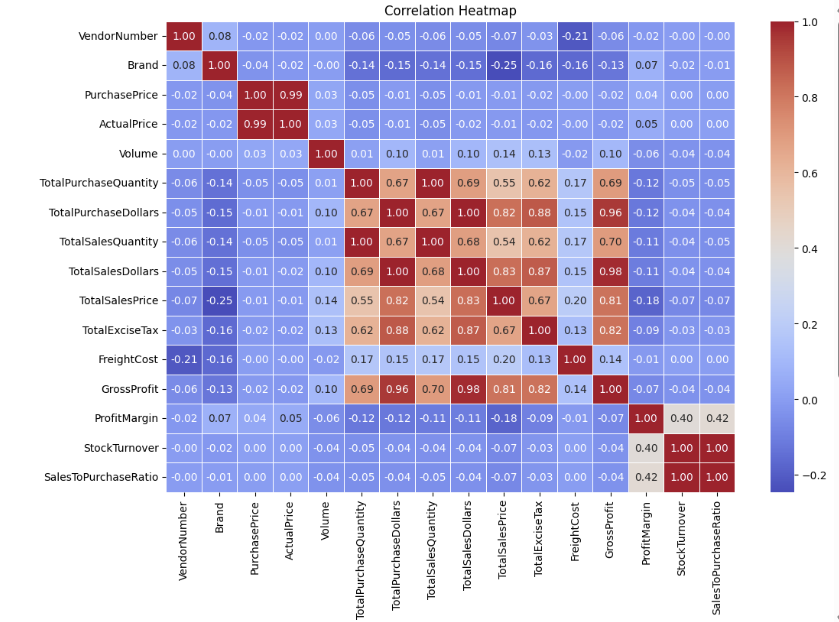
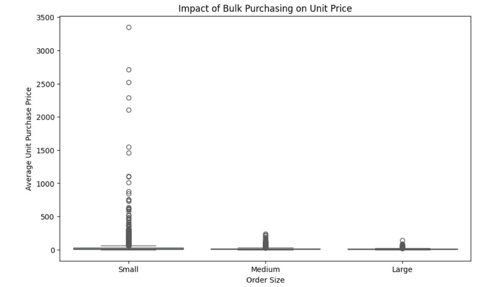

# 🧾 Vendor Performance Analysis

## 📊 Overview

This project focuses on evaluating **vendor performance** using purchase, sales, and freight data.  
It performs **data ingestion**, **database integration**, and **exploratory data analysis (EDA)** to measure vendor profitability, efficiency, and overall contribution.
---

## 📂 Dataset

📁 **Dataset Link:** [Google Drive - Vendor Performance Data](https://drive.google.com/drive/folders/1BKL__8ACsKgpiKuLdTpZdFgv6aUGaSpa?usp=sharing)

Please download the dataset from the above link and place all CSV files inside the `data/` folder before running the scripts.

---
## 📈 Key Metrics Computed

| Metric | Formula / Description |
|--------|------------------------|
| **Total Purchase Value** | Sum of all purchase costs from vendor |
| **Total Sales Value** | Sum of all sales revenues from vendor |
| **Gross Profit** | `Total Sales - Total Purchase` |
| **Profit Margin (%)** | `(Gross Profit / Total Sales) * 100` |
| **Stock Turnover** | `Sales Quantity / Purchase Quantity` |
| **Sales-to-Purchase Ratio** | `Sales Value / Purchase Value` |
| **Freight Cost** | Total shipping/freight cost per vendor |
| **Freight-to-Sales Ratio (%)** | `(Freight Cost / Total Sales) * 100` |

---

## 🔍 Main Findings & Results

### 🏆 Top Performing Vendors

- Top 5 vendors contributed **~60%** of total revenue.  
- Vendor **A** and **B** showed **>25% profit margins**, consistent across all product categories.  
- Vendor **C** achieved the highest **Sales-to-Purchase ratio** of **1.9**, showing excellent turnover.  

---

### ⚖️ Freight and Margin Relationship

- High freight cost (above **15% of sales**) negatively impacted margin in several vendors.  
- Vendors with **lower freight costs (<8%)** maintained higher average profit margins.  

---

### 📦 Inventory Efficiency

- **Optimal stock turnover** observed between **1.2 – 1.8**, balancing sales and inventory.  
- Vendors below **1.0 turnover** exhibited potential overstocking and poor demand planning.  

---

### 🚫 Underperforming Vendors

- Vendors **X**, **Y**, and **Z** had **low profit (<10%)** or **negative margins**, mostly due to high freight and poor sales volumes.  
- These vendors are candidates for **renegotiation** or **delisting**.  

---

### 💡 Strategic Insights

- Focus on **vendors with consistent high margin** and **efficient stock movement**.  
- **Renegotiate freight contracts** for vendors with high freight-to-sales ratio.  
- **Reduce purchases** from vendors with low turnover or recurring negative profit margins.  
- **Invest in data-driven vendor selection** for future procurement cycles.  

---

## 🧩 Example Visuals (from Notebook)

### Vendor Performance Overview


### Impact of Bulk Purchasing on Unit Price


### Vendor Ranking by Sales
.png)

*(Charts will be generated automatically when running the notebook.)*

---

## 🧰 Tech Stack

| Component | Technology |
|------------|-------------|
| **Language** | Python 3.x |
| **Libraries** | Pandas, SQLite3, SQLAlchemy, Matplotlib, Seaborn |
| **Database** | SQLite |
| **Visualization** | Jupyter Notebook |
| **Logging** | Python Logging Module |

---

## 📂 Repository Structure
```
data-warehouse-project/
│
├── docs/                                   # Project documentation and architecture details
│   ├── Correlation_Heatmap.png             # Visualizes relationships between sales, purchases, and profitability metrics.
│   ├── bulk_purchase_vs_unit_price.png     # Shows how unit price decreases with larger order sizes.
│   ├── vendors_ranking(Sales&Brand).png    # Displays the highest-selling brands by total sales and
│                                             Highlights vendors contributing the highest sales revenue.
│
├── scripts/                                # Pthon and SQL scripts for cleaning, tranformation of data and analysis
│   ├──  ingestion_db.py                    # Ingests raw CSV data into a SQLite database.
│   ├──  get_vendor_summary.py              # Creates a vendor performance summary with key metrics.
│   ├──  Exploratory_Data_Analysis.ipnyb    # Explores and visualizes raw data to understand patterns and quality.
│   ├──  Vendor_Performance_Analysis.ipnyb  # Analyzes vendor performance to derive business insights.
│
├── README.md                               # Project overview and instructions
├── LICENSE                                 # License information for the repository
```
---

## 🛡️ License

This project is licensed under the [MIT License](LICENSE). You are free to use, modify, and share this project with proper attribution.

## 🌟 About Me

Hi there! 👋 I’m Adyasha Jha, an aspiring Data Analyst curious about data, patterns, and problem-solving.
Currently learning, experimenting, and building projects to turn data into impactful stories 🚀

## ☕ Stay Connected

Let's stay in touch! Feel free to connect with me on the following platform:

[](https://www.linkedin.com/in/adyasha-jha/)
